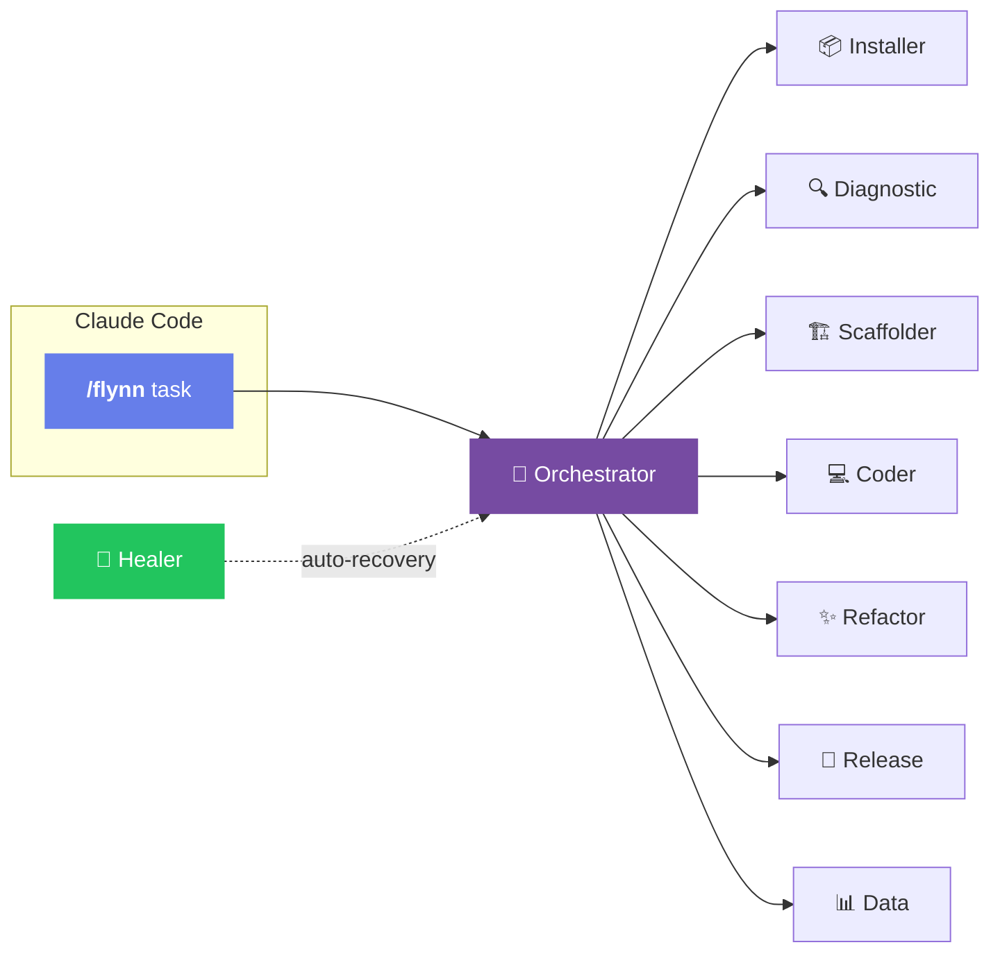

<div align="center">
  
</div>

<p align="center">
  
  
  
  
</p>

<p align="center">
  <b>Multi-Agent AI system that extends Claude Code with specialized expert agents</b>
</p>

<p align="center">
  <a href="#-installation">Installation</a> ·
  <a href="#-how-it-works">How it Works</a> ·
  <a href="#-agents">Agents</a> ·
  <a href="#%EF%B8%8F-configuration">Config</a>
</p>

<br/>

## Why Flynn?

Instead of one general-purpose AI, Flynn routes your tasks to **specialized expert agents** - each optimized for specific domains. Built on [Mastra](https://mastra.ai) with persistent memory and self-healing.

<br/>

## 🚀 Installation

```bash
curl -fsSL https://raw.githubusercontent.com/reze83/Flynn-Project/main/install.sh | bash
```

<details>
<summary>Manual Installation</summary>

```bash
git clone https://github.com/reze83/Flynn-Project.git
cd Flynn-Project && pnpm install && pnpm build
export ANTHROPIC_API_KEY="sk-..."
```
</details>

<br/>

## 🔄 How it Works



<br/>

## 🤖 Agents

| Agent | Triggers | What it does |
|:------|:---------|:-------------|
| **📦 Installer** | `install` `setup` `bootstrap` | Dependencies & environment setup |
| **🔍 Diagnostic** | `diagnose` `debug` `fix` `error` | Error analysis & troubleshooting |
| **🏗️ Scaffolder** | `create` `new` `scaffold` `init` | Project & component generation |
| **💻 Coder** | `implement` `code` `write` `add` | Feature development |
| **✨ Refactor** | `refactor` `improve` `optimize` | Code quality improvements |
| **🚀 Release** | `release` `publish` `version` | Version & release management |
| **📊 Data** | `data` `csv` `pandas` `ml` | Data analysis & ML inference |
| **💚 Healer** | *(automatic)* | Failure recovery & retry |

<br/>

## 📝 Usage Examples

```bash
/flynn install dependencies for Next.js      # → Installer Agent
/flynn diagnose why tests are failing        # → Diagnostic Agent
/flynn create a REST API with Express        # → Scaffolder Agent
/flynn implement JWT authentication          # → Coder Agent
/flynn refactor for better readability       # → Refactor Agent
/flynn prepare release v2.0.0                # → Release Agent
/flynn analyze sales.csv                     # → Data Agent
```

<br/>

## ⚙️ Configuration

<table>
<tr>
<td width="50%">

**XDG Paths**
```
~/.config/flynn/        # Config
~/.local/share/flynn/   # Data
~/.cache/flynn/         # Cache
```

</td>
<td width="50%">

**Security Policy**
```yaml
# config/flynn.policy.yaml
permissions:
  shell:
    allow: ["git *", "pnpm *"]
    deny: ["rm -rf /", "sudo *"]
```

</td>
</tr>
</table>

<br/>

## 🛠️ Development

```bash
pnpm install    # Install dependencies
pnpm build      # Build all packages
pnpm test       # Run 169 tests
pnpm lint       # Check code quality
```

<details>
<summary>Project Structure</summary>

```
Flynn-Project/
├── packages/
│   ├── core/        # Shared utilities
│   ├── bootstrap/   # Self-installation
│   ├── agents/      # Mastra agents
│   ├── tools/       # Mastra tools
│   └── python/      # Data/ML tools
├── apps/server/     # MCP Server
└── config/          # Policy & capabilities
```
</details>

<details>
<summary>Tech Stack</summary>

| | Technology | Purpose |
|:--:|:-----------|:--------|
| 🤖 | [Mastra](https://mastra.ai) | Agent Framework |
| 🔌 | [MCP](https://modelcontextprotocol.io) | Model Context Protocol |
| 💾 | [LibSQL](https://turso.tech/libsql) | Memory Storage |
| 🧹 | [Biome](https://biomejs.dev) | Linting & Formatting |
| 🧪 | [Vitest](https://vitest.dev) | Testing |

</details>

<details>
<summary>Prerequisites</summary>

| Requirement | Version | Notes |
|:------------|:--------|:------|
| Node.js | `≥ 20` | Required |
| pnpm | `≥ 9` | Required |
| Claude Code | latest | With Pro/Max plan or API key |
| Python | `≥ 3.11` | Optional, recommended |
| uv | latest | For Python dependencies |

</details>

<br/>

---

<p align="center">
  <sub>Built with <a href="https://mastra.ai">Mastra</a> · Powered by <a href="https://anthropic.com">Claude</a></sub>
</p>

<div align="center">
  
</div>
